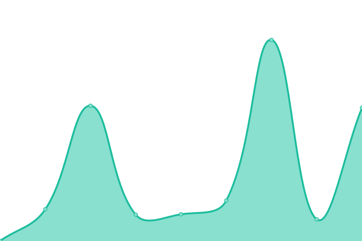

# [📈 Live Status](https://status.marcreyes.xyz): <!--live status--> **🟧 Partial outage**

This repository contains the open-source uptime monitor and status page for [Marc Reyes](https://marcrey.es/), powered by [Upptime](https://github.com/upptime/upptime).

With [Upptime](https://upptime.js.org), you can get your own unlimited and free uptime monitor and status page, powered entirely by a GitHub repository. We use [Issues](https://github.com/mabreyes/status/issues) as incident reports, [Actions](https://github.com/mabreyes/status/actions) as uptime monitors, and [Pages](https://status.marcreyes.xyz) for the status page.

<!--start: status pages-->
<!-- This summary is generated by Upptime (https://github.com/upptime/upptime) -->
<!-- Do not edit this manually, your changes will be overwritten -->
<!-- prettier-ignore -->
| URL | Status | History | Response Time | Uptime |
| --- | ------ | ------- | ------------- | ------ |
|  [Main website](https://marcreyes.ph) | 🟩 Up | [main-website.yml](https://github.com/mabreyes/status.marcreyes.xyz/commits/HEAD/history/main-website.yml) | 

 181ms
     
 | 

<a href="https://status.marcreyes.xyz/history/main-website">100.00%</a>
    

|  [cdn-static-s3](https://cdn-static-s3.marcreyes.xyz/liveness.txt) | 🟩 Up | [cdn-static-s3.yml](https://github.com/mabreyes/status.marcreyes.xyz/commits/HEAD/history/cdn-static-s3.yml) | 

 912ms
     
 | 

<a href="https://status.marcreyes.xyz/history/cdn-static-s3">100.00%</a>
    

|  [cdn-s3](https://cdn-s3.marcreyes.xyz/liveness.txt) | 🟩 Up | [cdn-s3.yml](https://github.com/mabreyes/status.marcreyes.xyz/commits/HEAD/history/cdn-s3.yml) | 

 926ms
     
 | 

<a href="https://status.marcreyes.xyz/history/cdn-s3">100.00%</a>
    

|  [Blog (Medium)](https://blog.marcreyes.ph) | 🟩 Up | [blog-medium.yml](https://github.com/mabreyes/status.marcreyes.xyz/commits/HEAD/history/blog-medium.yml) | 

 1669ms
     
 | 

<a href="https://status.marcreyes.xyz/history/blog-medium">99.38%</a>
    

|  [Mail (Google Workspace)](http://mail.marcreyes.ph) | 🟩 Up | [mail-google-workspace.yml](https://github.com/mabreyes/status.marcreyes.xyz/commits/HEAD/history/mail-google-workspace.yml) | 

 275ms
     
 | 

<a href="https://status.marcreyes.xyz/history/mail-google-workspace">100.00%</a>
    

|  [DEV](https://dev.marcreyes.ph) | 🟩 Up | [dev.yml](https://github.com/mabreyes/status.marcreyes.xyz/commits/HEAD/history/dev.yml) | 

 276ms
     
 | 

<a href="https://status.marcreyes.xyz/history/dev">100.00%</a>
    

|  [XYZ](https://marcreyes.xyz) | 🟩 Up | [xyz.yml](https://github.com/mabreyes/status.marcreyes.xyz/commits/HEAD/history/xyz.yml) | 

 56ms
     
 | 

<a href="https://status.marcreyes.xyz/history/xyz">100.00%</a>
    

|  [URL shortener (Rebrandly)](https://marcrey.es) | 🟥 Down | [url-shortener-rebrandly.yml](https://github.com/mabreyes/status.marcreyes.xyz/commits/HEAD/history/url-shortener-rebrandly.yml) | 

 0ms
     
 | 

<a href="https://status.marcreyes.xyz/history/url-shortener-rebrandly">0.00%</a>
    

<!--end: status pages-->

[**Visit our status website →**](https://status.marcreyes.xyz)

## 📄 License

- Powered by: [Upptime](https://github.com/upptime/upptime)
- Code: [MIT](./LICENSE) © [Marc Reyes](https://marcrey.es/)
- Data in the `./history` directory: [Open Database License](https://opendatacommons.org/licenses/odbl/1-0/)
